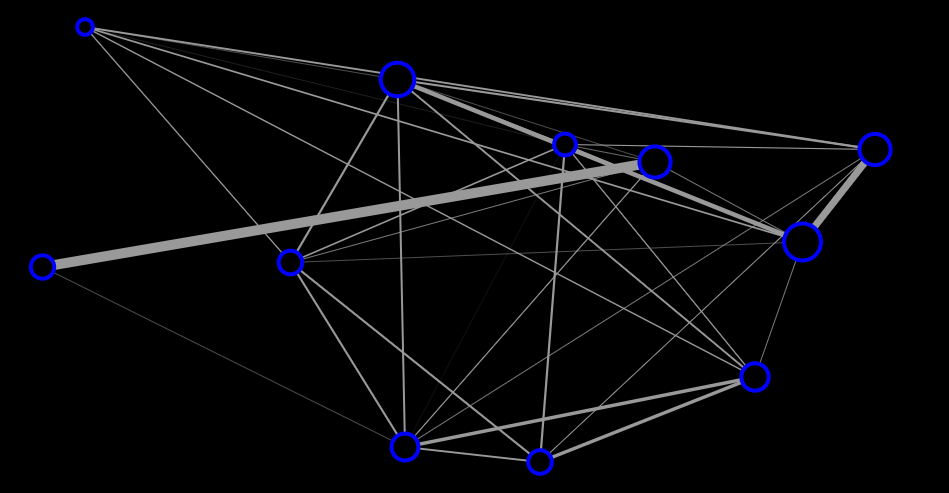
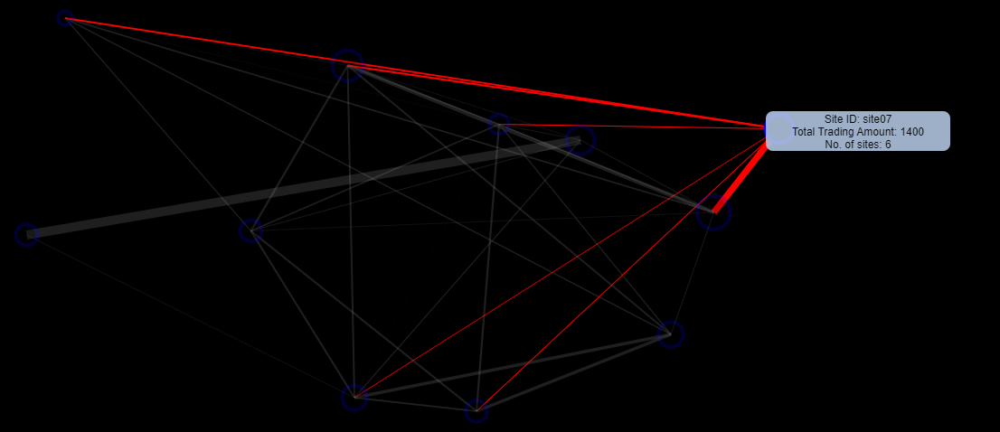

A Visual Interaction of Trading Data.

The below shows visual interaction for trading data between 11 sites. The size of the circle that represents each site is directly proportional to the trading amount made by that site. The smaller the trading amount the smaller the circle. 

Hover over each glowing circle which shows total trading amount corresponding to the site ID .

